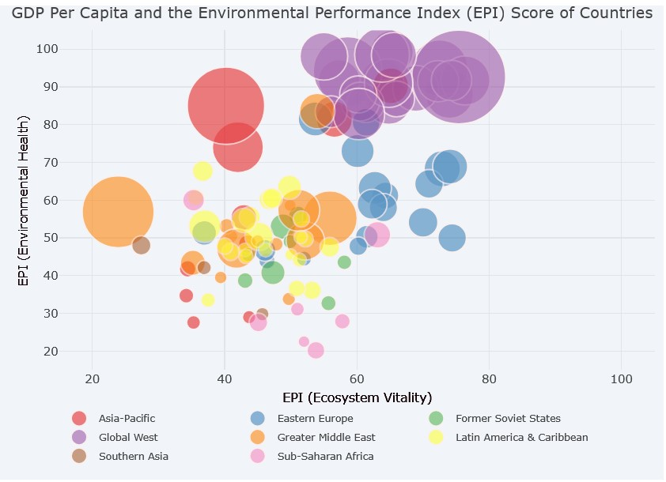

# EnvironmentalPerformance

https://rpubs.com/shutupandtakemydata/763814

Creating a clearer visualisation of the World Environmental Performance Index (EPI)
Environmental Performance Visualization
Objective
This visualization aims to provide an overview of environmental performance across countries worldwide. It seeks to inform viewers about their country’s ecological health and sustainability status.

While the visualization is accessible to anyone with a general interest in the planet’s condition, it is particularly valuable for audiences concerned about sustainability, greenhouse gas emissions, and global warming.

Identified Issues
The chosen visualization, based on the Environmental Performance Index (EPI), has three main limitations:

Unclear Purpose:
The visualization does not clearly communicate a practical question or insight. Although patterns emerge on the map, it remains ambiguous what the creator wants the viewer to conclude.
Oversimplification Using Color:
The use of a single color gradient to represent how “green” a country is oversimplifies and somewhat misrepresents the source data. The EPI includes detailed sub-categories like Ecosystem Vitality and Environmental Health (Wendling et al., 2020), which are not reflected in this visualization.
Map Distortions and Comparability Issues:
The map projections distort country sizes, emphasizing some while downplaying others. Combined with varying country sizes and the number of observations, this makes direct comparisons difficult.

Reference
Galetan. (2019, March 20). [OC] How green is your country? A look at the Environmental Performance Index (EPI) Scores Worldwide. Retrieved April 15, 2021, from Reddit:
https://www.reddit.com/r/dataisbeautiful/comments/b2xv3c/oc_how_green_is_your_country_a_look_at_the/
